# AWS LightSail Tips

## Create an Instance

Go to the AWS Management Console.

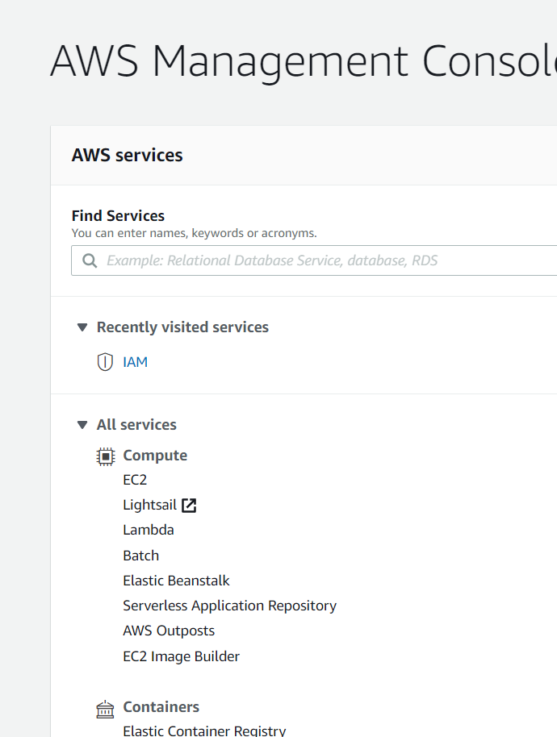

Click Create Instance

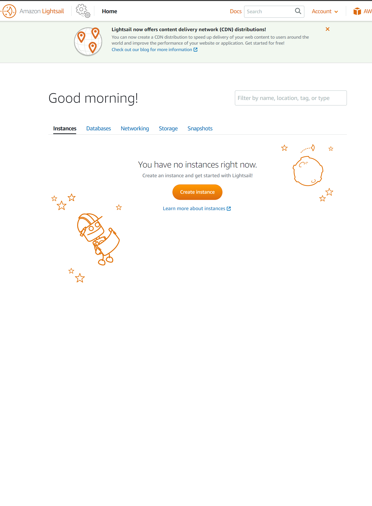

Choose your Operating System and pre-installed software

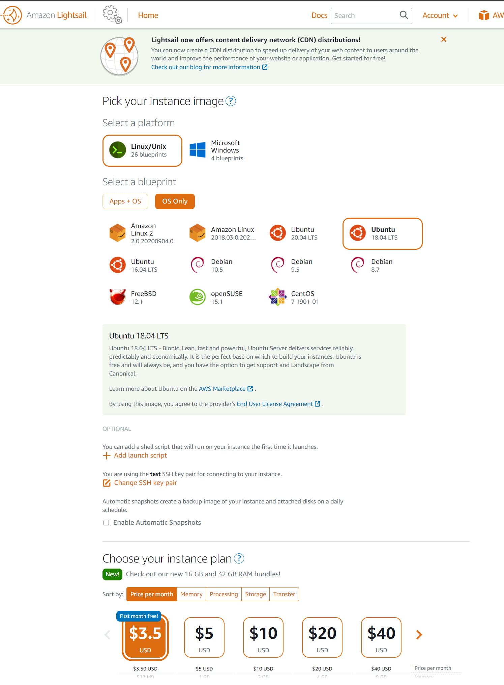

Create the instance

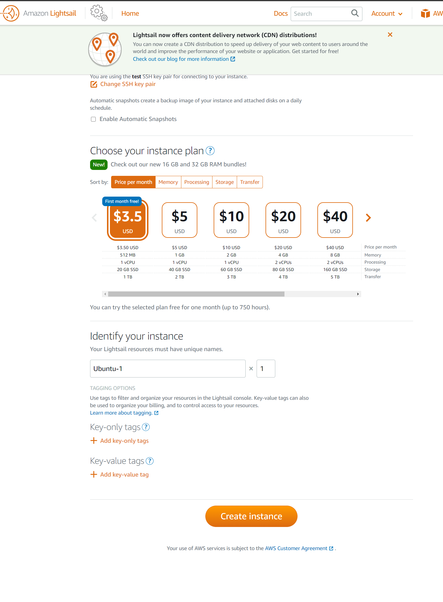

Wait for the instance to boot

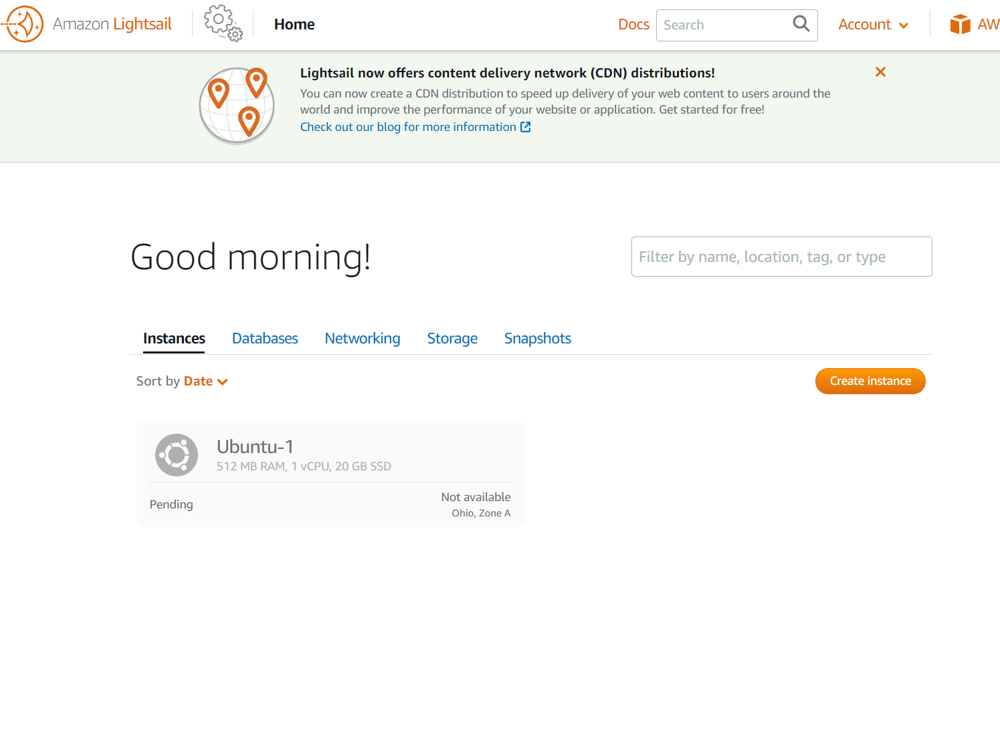

Click on the console button to bring up the browser-based console

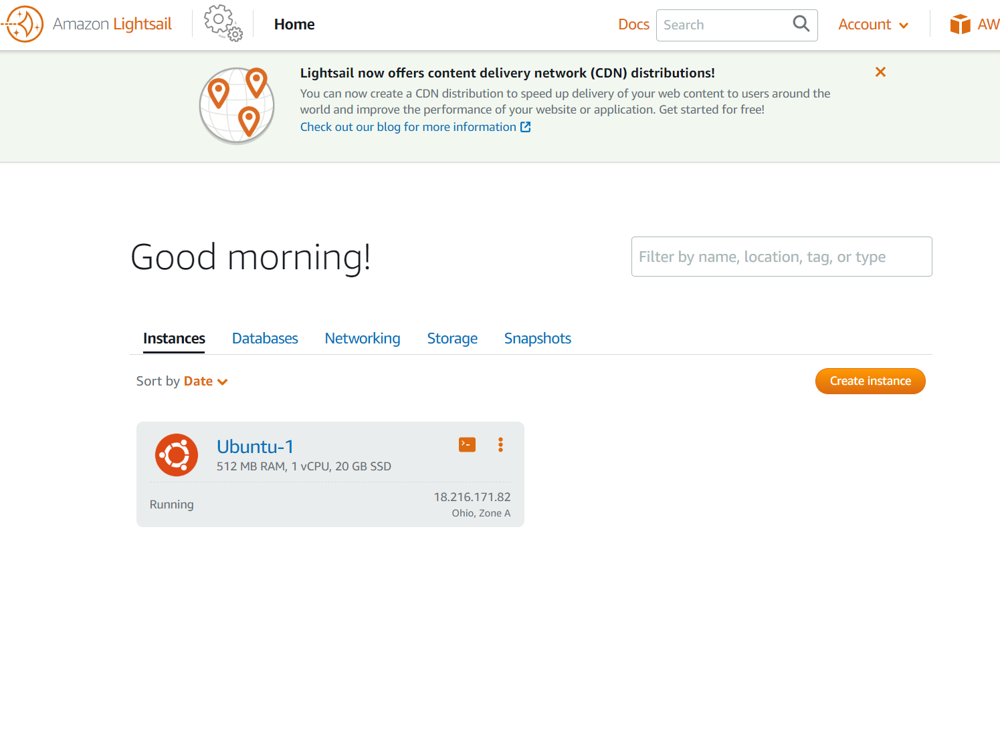

Use the browser-based console to make changes

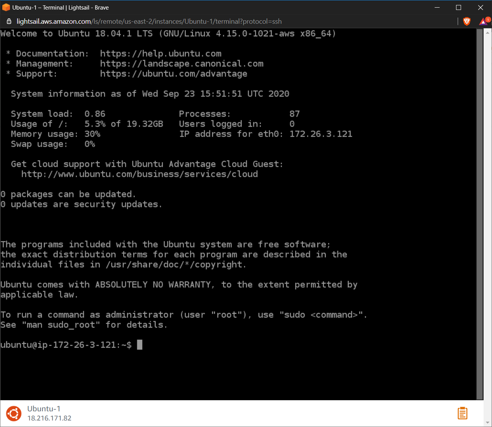

You likely will need to unblock a port on your new machine.

To do this, you need to manage your instance's settings.

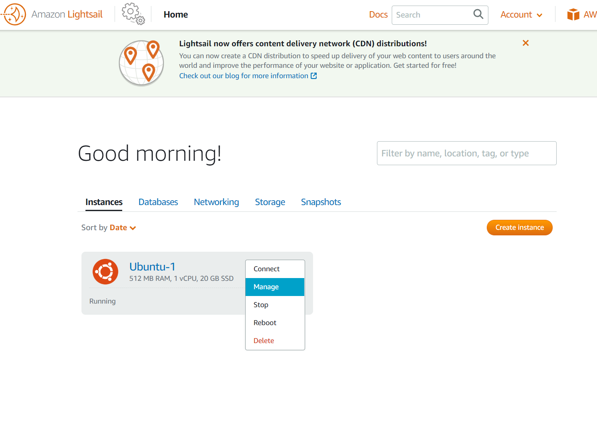

Click Networking

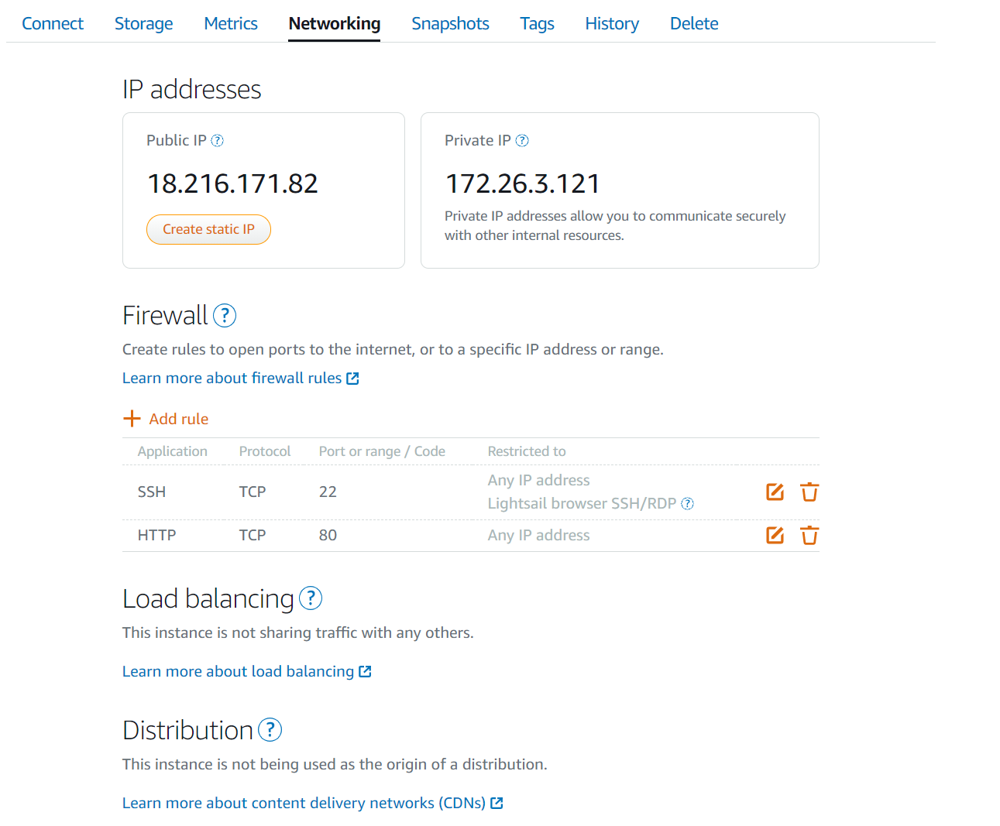

Add new a new rule with the port you want to unblock

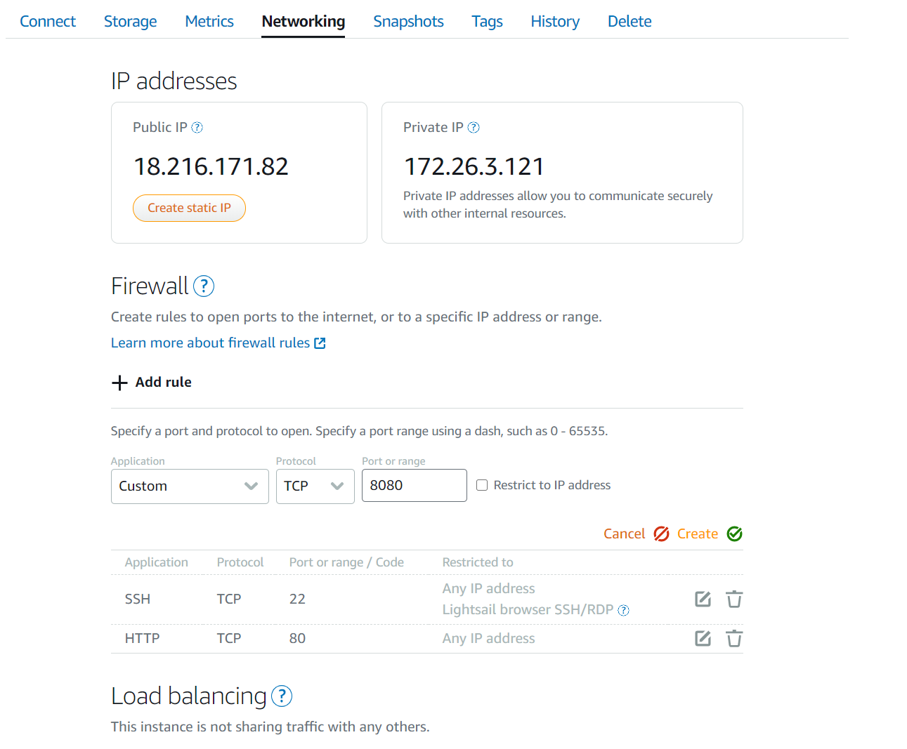

Add the new rule

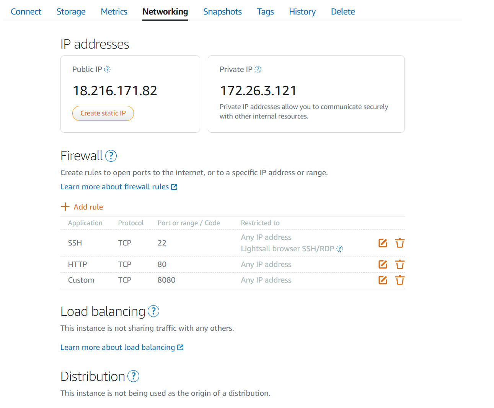

